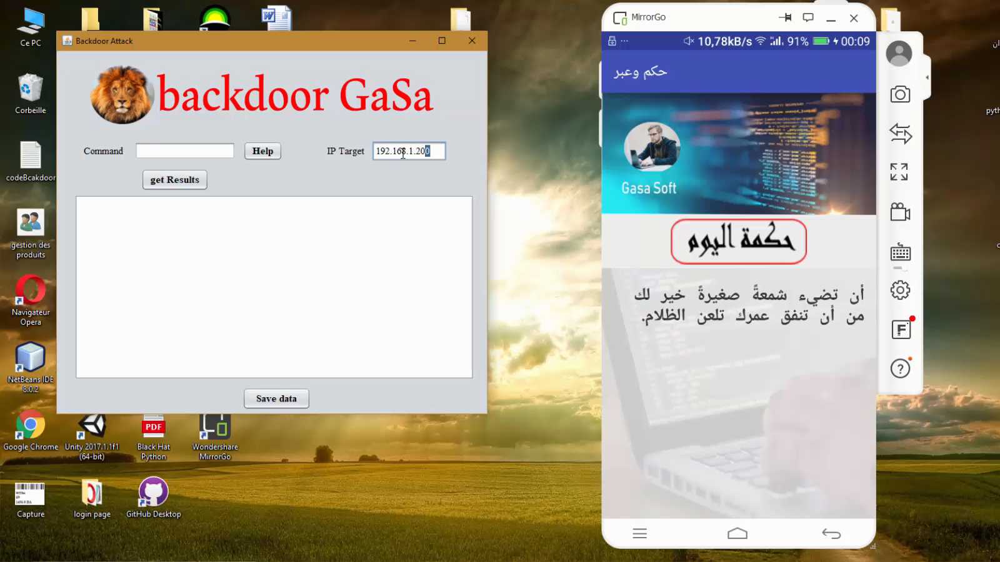

# create-your-own-mobile-application-backbood-attack-controlled-by-remote-desktop-application
get all personal info about the target after hi /she installed this mobile app in his/her mobile phone using desktop application
# all available commands :
- info : get information about device target.
- info-n : get information about network (SIM) device target.
- show : show  text in device target exemple(show text).
- contact : get list contact from device target.
- contact-l : get all logs contact from device target.
- sms : get all sms list target.
- sms-s : send an sms into specific numbere exemple(sms-s 06XXXX text).
- call : call a specific numbere by device target exemple(call 06XXXX).
# screenshot

# demonstration video
https://www.youtube.com/watch?v=ouBmu76u8wY&feature=youtu.be
